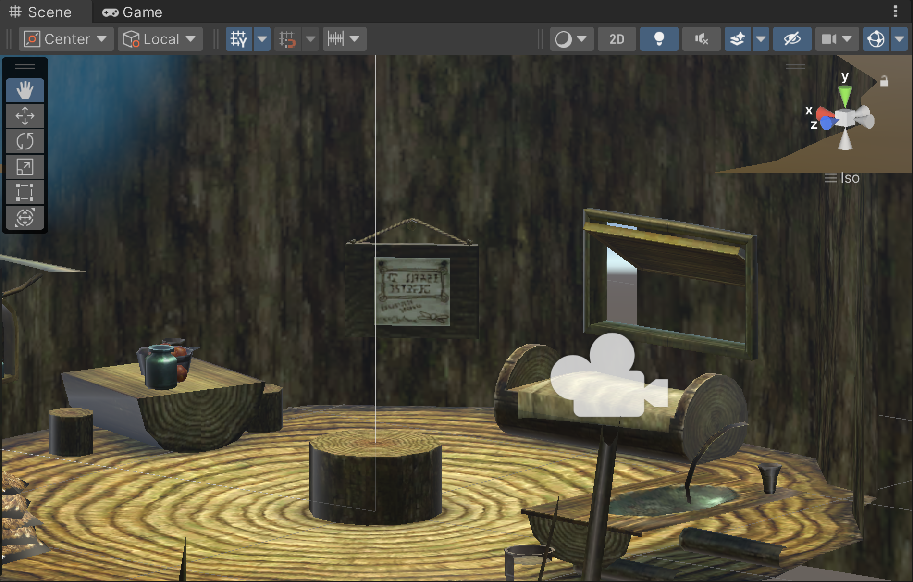
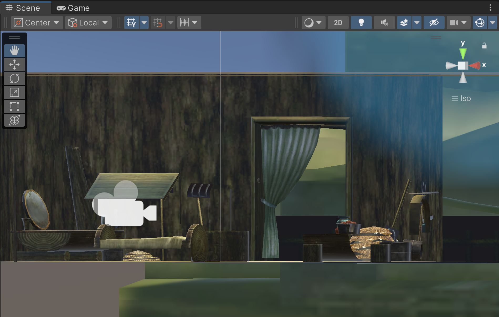
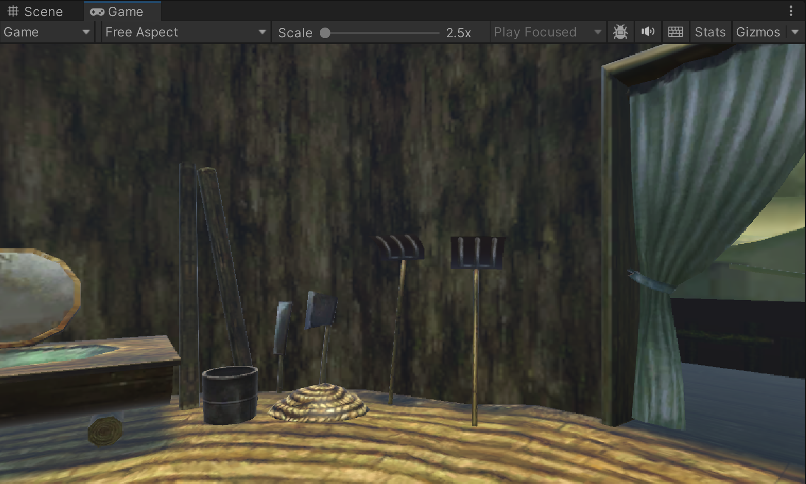

# Mesh-Rendered Interior (Unity Version)

## Features (Compared to OpenGL Version)

###### Implementing a Unity version involved completely different stratgies on file reading and coding, which also involved a lot of work. Thus, the final version of my project is unique enough from what I have done in the original University project.

1. **Configure** the original polygon files to something **compatible** with Unity.
2. Figure out how to **transfer** the **UV coordinates** for triangle meshes into the new compatible files.
3. **Match the bitmaps** with the new 3D models.
4. Design a **different method** of **camera controll**, including touchscreen interaction.
5. Add annotations for better explanation inside the demo.

## Stories Behind the Work

In the beginning, I thought that transferring a OpenGL project into Unity is *not that hard* because Unity is famous for high compatibility, but I **overlooked** that Unity **cannot recognize** the **original polygon files**, this is where lots of problems/issues start...

I tried the popular method of converting 3D objects online. The resulting model can be applied in the Scene, but it **cannot recognize** the **texture bitmaps** that should be assigned on each of the model. So, it takes *another long time* for me to figure out the solutions... (And this is probably the hardest part of transferring to Unity.)

Through tons of research, I finally realized: The original OpenGL project used **vertices** to calculate triangle meshes, where the **UV coordinates** is the ***key*** of encapsulating textured triangle meshes. Then, I dig out online to see how to keep the UV coordinates for every new 3D model, the correct textures can be appplied eventually!

*(After that, apply a new camera method is much easier compared to those previous steps...)*

## Screenshots

