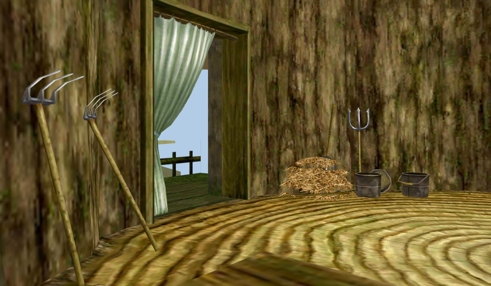
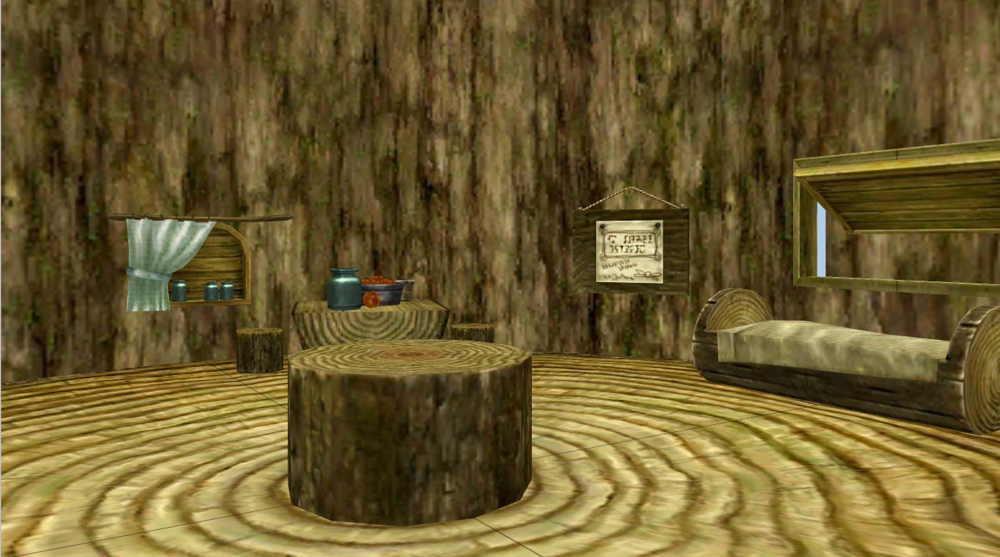
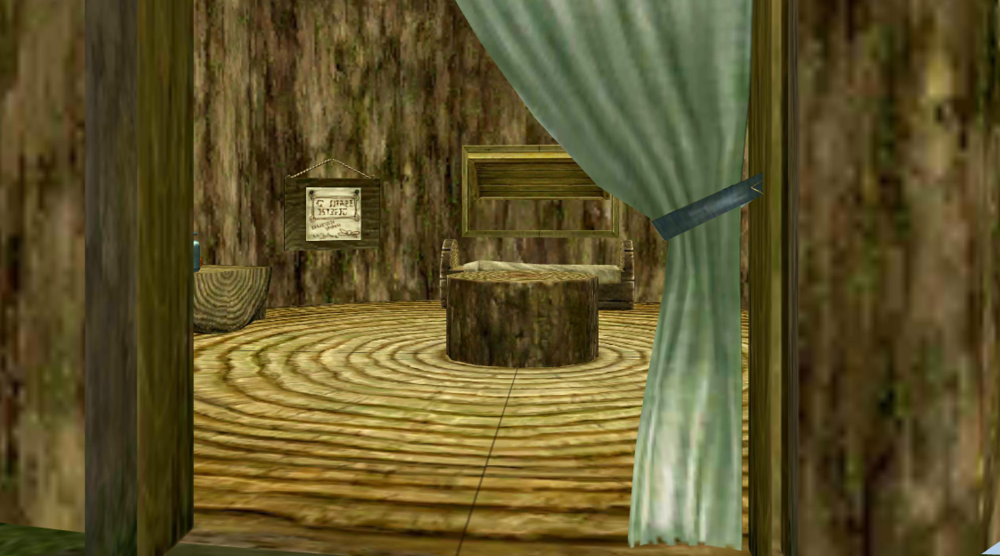

# Mesh-Rendered Interior (OpenGL Version)

## Features (What Was Built)

1. **Read & store triangle meshes** from polygon files based on verticies & faces. 
2. **Encapsulate the meshes** with associated bitmap files.
3. **Render textured meshes** using **VBO**s and **VAO**s in *OpenGL*.
4. **Manipulate the camera view** to move around.

## Installation

###### ***(Unfortunately, this project is only runnable for Linux...)***
> ###### (If you are using *Windows*, to run the code, you probably need to install "[WSL](https://learn.microsoft.com/en-us/windows/wsl/install)", then you can follow the setup guide below once your WSL environment was set up...)

1. Download the zip folder:
```
<> Code → Download ZIP
```
2. Unzip the zip folder on your computer:

###### (This is a sample step, it may be differ based on your zipping software...)

```
*Right click* → Extract All...
```

3. Open the terminal from the extracted folder. Install these packages: 

```
sudo apt-get update
sudo apt install gcc g++ 
sudo apt install libopengl-dev
sudo apt install libglfw3-dev
sudo apt install freeglut3-dev
sudo apt-get install libglew-dev libglfw3-dev libglm-dev
```

###### (For not messing things around, please copy-and-paste each line *one-by-one* when executing...)

4. Once those packages were installed, run this command:

```
g++ -o main main.cpp -lGLEW -lglfw -lGL -lm
```

5. Once step 4 is finished, run this command, then you can enjoy my work! (Probably not that enjoyable compared to my final version...)

```
./main
```

## Stories Behind the Work

This project's main idea was actually based on part of the assignments from one of my university courses —— Computer Graphics.

The course taught some basic theories like rastering, buffering and rendering. This project is applying those theoratical portion into application, where the core part of coding, like loading and rendering mesh & texture data, was done by myself.

However, I think this project was kind of *"stale"* as this is **not** a **cross-platform** source code (Restricted to Linux only...), thus I decided to transfer this work into a popular game engine, make it to be a cross-platform version and looks more natural compared to the work in this `branch`.

## Screenshots





