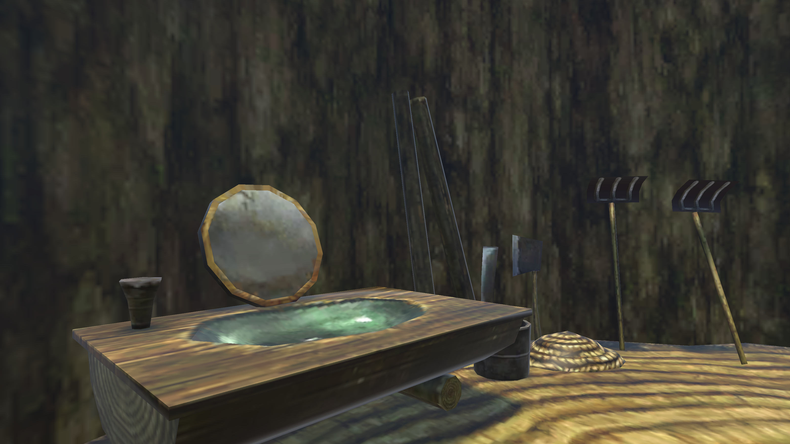
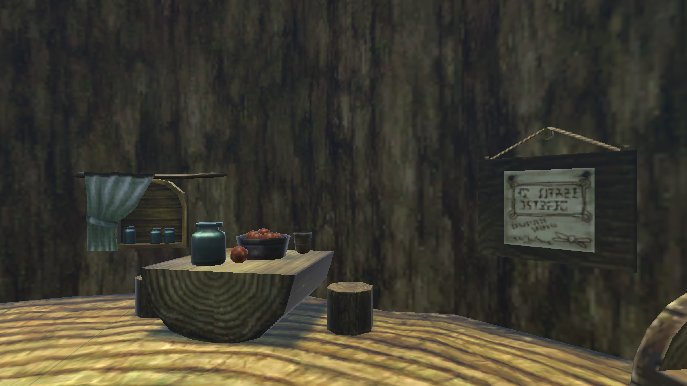
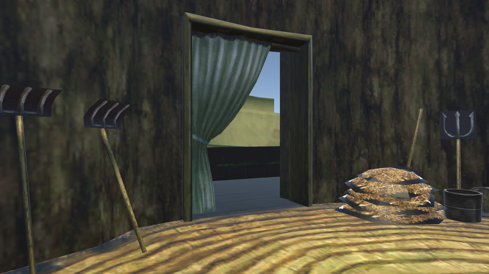

#### _**Warning: For better user experience, please open this web game using your PC instead of smartphone...**_

###### Belows are my instructions and notes for every user (*player*)  who wants to know more.

# Mesh-Rendered Interior

Hi, welcome to my mesh-rendered interior game demo recreation...

> ##### **"We have already seen these sentences in your demo, show something new in your source code website."**

Alright, **new stuffs**: 

## Features

###### I have provided some tips in the game demo, but it looks like the window space was compromised, so I have to list more here:

1. See what happens when you do **click and drag**.
2. See what happens when you **scroll the wheel**.
3. If you think the **tips window** is annoying, *there is a way to close it*.
4. The **text** at the bottom of the game demo **is clickable**. 

## Installation

You do not need to install anything to run this game demo, just click on the link given [here](https://2h-5.github.io/mesh-rendered-interior/). Do not worry, this link is not malicious as I deployed it using **GitHub Pages**.

> ###### Warning again: *For better user experience, please open this web app using your PC instead of smartphone...* 

## Stories Behind the Work

This is my second individual **Unity** project, the main idea was based on part of the assignments from one of my university courses —— Computer Graphics.

However, I further extended more functionalities based on the original university project, such as *3D model conversion, new mesh-texture encapsulation, new camera controls, etc.* (Which I will talk a bit more about **iterations** through each prototype in different `branches`.)

And this should make this project unique enough from I have done previously. *(Hopefully...)*

## Screenshots

